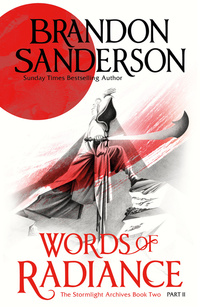
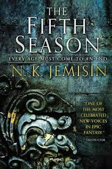
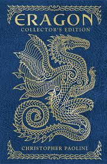
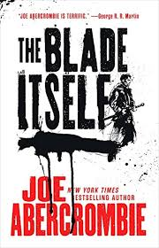
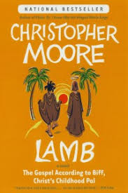

# Introduction
Top 5 fantasy books I've Read
----------
1. ### Words of Radiance - *Brandon Sanderson*

> “Words are where most change begins.”
2. ### The Fifth Season - *N.K. Jemisin*

> “This is what you must remember: the ending of one story is just the beginning of another.” 
3. ### Eragorn - *Christopher Paolini*

>“There is much you can learn from books.”
4. ### The Blade Itself - * Joe Abercrombie*

> "You can never have too much ambition"
5. ### Lamb - *Christopher Moore*

>“... but to remain historically accurate, I would have had to leave out an important question that I felt needed to be addressed, which is, 'What if Jesus had known kung fu?”
