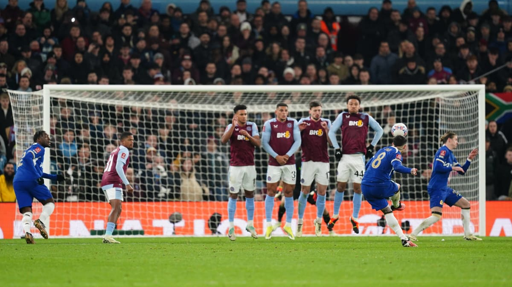

# Premier League 23/24

## Which team has the most wins
Arsenal, Liverpool and Manchester City are joint-top with 15 wins.

### Which team has the most goals?
Manchester City currently leads the league with 54 goals, followed by Liverpool with 52 and Aston Villa with 49.

***Goals and Assists in PL***
-----------
* Goals
  * Haaland - 14
  * Salah - 14
  * Solanke - 13
* Assists
  * Watkins - 10
  * Trippier - 9
  * Groß - 9
    
___Current Standings___
----------
1. Liverpool
2. Manchester City
3. Arsenal

> This table shows top 3 league position, club, points, goals for, goals against and goal difference.

| Position | Club | Points | GF | GA | GD |
| :-------- | :-------: | --------: | --------: | --------: | --------: |
| 1 | Liverpool | 51 | 52 | 22 | 30 |
| 2 | Manchester City | 49 | 54 | 25 | 29 |
| 3 | Arsenal | 49 | 47 | 22 | 25 |

---
***
#### Relative Links
[Welcome message in folder](RoshawnL.md)
***
___
#### Images


```html
<html>
    <head>
        <title>Documentation Tutorial</title>
    </head>
    <body>
    </body>
</html>
```
