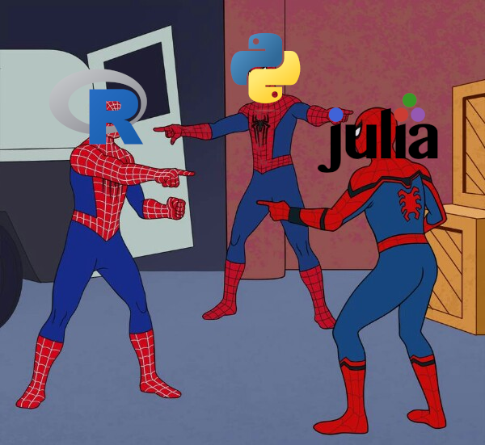

_This is based on the tutorial found at [Programming Historian](https://programminghistorian.org/en/lessons/getting-started-with-markdown)._

# Introduction

The comparison between [`R`](https://www.r-project.org/), [`Python`](https://www.python.org/) and [`Julia`](https://julialang.org/) in the field of data science can seem an arbitrary one as they all have their own benefits and trade-offs. It greatly depends on what your requirements are.

# What Is Data Science?

> Statistics can do all sorts of things. I love statistics! But it’s not the most important part of data science, or even close.[^1]
>
> _Andrew Gelman_

I've always viewed mathematics, specifically statistics as the largest part of data science.

When data science was starting to be hailed as the "sexiest job of the 21st century"[^2], I took note. Who doesn't want to be described by that moniker in some capacity? Yet chasing the dream seemed far away, especially with my previous viewpoint on it, a place of purely numbers and statistics.

But my viewpoint has evolved, even if the world still attaches the same moniker[^3] to it. Data Science can be described as a "discipline that allows you to transform raw data into understanding, insight, and knowledge."[^4]
There is **_a lot_** hidden within the word [_transform_](https://arxiv.org/abs/2011.01808), but all we will say on that if you're not careful, it can be [dark and full of terrors](https://media.giphy.com/media/v1.Y2lkPTc5MGI3NjExeTlwcmRiaDk3NWt3MmZmYXcxc3ozaTg4dHZvZHM3MGJyZ2toZXozdSZlcD12MV9pbnRlcm5hbF9naWZfYnlfaWQmY3Q9Zw/Qw4X3FN8Elnz2ew3UFa/giphy.gif).

**<ins>Always</ins>** have a _good_ guide.

A good guide will likely lead you to choose (at least) one of the three starter ~~poké-~~ programming languages. Let's have a quick look at each.

# Comparisons

> Imitation is the sincerest form of flattery mediocrity can pay to genius.[^5]
>
> _Attributed to Oscar Wilde in The Daily News Leader of Staunton, Virginia_

I strongly dislike the above quote, and am of the opinion many in the field of computer science would agree with me. Instead, I much more prefer the artists’ viewpoint of [inspiration](https://might-could.com/essays/inspiration-vs-imitation-how-to-copy-as-an-artist/).

Even in the narrow range of computer languages, taking inspiration is an acceptable norm.

R was inspired by S, another programming language, it was to the point you could run S scripts with R[^6].

Python was designed to be a 'descendant of the ABC language that would appeal to Unix and C hackers'[^7].

Julia itself was inspired by R and Python, plus a few other languages[^8].

In the grand scheme of things, with the rise of data science, ideas have been shared and developed between practitioners and thus between languages, after all its the communities that shape them. It's easy then for me to thus comfortably state that data science tasks can be done quite well in any language, then the choice boils to a difference of degree and not of kind.

Now I'm supposed to actually *compare* the languages, and I will... at some point. For now let's settle for a list of **definitely opinionated surmising** which may or may not trigger you.

## R

- **Core Unique Ideas**: R is a programming language built for statistics.
  - It offers data-wrangling packages, visualization tools, and supports statistical models while being optimal for academia (think r-markdown and now quarto for everyone).
- **Strengths**: R is easy to learn and can help data scientists handle multiple forms of data with ease.
  - It provides excellent support for data wrangling, and has a vast array of statistical packages and facilitates quality plotting and graphing.
- **Weaknesses**: R is slower and more memory-intensive than the others.
  - It can struggle with big data sets, as it's designed to load the entire data into memory. (They are packages and backends to get around this, but it’s not feasible in the standard library.)
- **When to Favour**: R is favoured when the task involves statistical models, data visualization, and academia-related work.

## Python

- **Core Unique Ideas**: Python is a high-level, general-purpose programming language that is widely used in data science, machine learning, artificial intelligence, and server & web applications.
- **Strengths**: Python is known for its powerful features, flexibility, and ease of use.
  - It has an extremely large user base, ecosystem and an accompanying wide range of libraries and tools, including for data science. It's general language nature and wide adoption means it's a better glue language than the others.
- **Weaknesses**: Python was not designed from the ground up for statistical work and thus lags behind R in packages and documentation in this field. (Julia is quite young in comparison, so my opinion is Python has it beat there. This does not apply to machine learning however, where Python stands on top.)
- **When to Favour**: Python is favoured when the task involves machine learning, artificial intelligence, server & web applications, or any other task where its myriad of packages and ability as a 'glue language' such as in production, comes to fore.

## Julia

- **Core Unique Ideas**: Julia is a high-performance programming language introduced for technical computing, with syntax that is familiar to users of other technical computing environments.
- **Strengths**: Julia is fast, and can often be faster than the other languages.
  - It states it solves the two-language problem (which in my humble, naive opinion, isn't a problem, unless you're a developer who has hit the boundaries of your computation speed, and/or development speed). Julia is primarily written in Julia, and that coupled with multiple dispatch[^9] makes it easy to extend and specialise.
  - It has an excellent and expressive syntax which gives probably the best trade-off between static and dynamic typing, that with its well thought out types for handling numbers makes it really nice for certain tasks.
  - It's also designed with parallel and distributed computing in mind, making it easy to scale up data-intensive computation (although I've no current experience in this).
- **Weaknesses**: Julia is a relatively new language and thus has a smaller community and less diverse packages compared to the other languages. There's also the risk of trying something new[^10], which admittedly is a debateable can depend on use case and preference.
- **When to Favour**: Julia is favoured for data science tasks that require high performance.

# Conclusion
Regardless of your choice remember two things:

Your choice will put great deal of power at your fingertips and
> With Great Power, Comes Great Responsibility

So don't make it a burden for yourself, instead just remember
> It's What We Do.[^11]

---

# References

[^1]: [Statistics is the _least_ important part of data science](https://statmodeling.stat.columbia.edu/2013/11/14/statistics-least-important-part-data-science/)
[^2]: [Data Scientist: The Sexiest Job of the 21st Century](https://hbr.org/2012/10/data-scientist-the-sexiest-job-of-the-21st-century)
[^3]: [Is Data Scientist Still the Sexiest Job of the 21st Century?](https://hbr.org/2022/07/is-data-scientist-still-the-sexiest-job-of-the-21st-century)
[^4]: [R for Data Science (2e) - Introduction](https://r4ds.hadley.nz/intro)
[^5]: [Quote Origin: Imitation Is the Sincerest Form of Flattery That Mediocrity Can Pay To Greatness](https://quoteinvestigator.com/2024/01/19/imitation-flattery/)
[^6]: [History and Overview of R](https://bookdown.org/rdpeng/rprogdatascience/history-and-overview-of-r.html)
[^7]: [A Brief History of Python](https://learnpython.com/blog/history-of-python/)
[^8]: [Why We Created Julia](https://julialang.org/blog/2012/02/why-we-created-julia/)
[^9]: This was partially the reason I started using it in my personal time, I wanted to create something which required both units and uncertainty, thus Measurements.jl, and Unitful.jl became my gateway.
Still R is my go-to, I'm fully capable of doing what I need in it, and the community is great.
An example is the vast number of free books to learn any particular aspect. Honestly, how do these people write so much?
[^10]: In my humble, and mayhap quite wrong opinion, the [multiple dispatch](https://en.wikipedia.org/wiki/Multiple_dispatch) used by Julia brings a great deal of benefits (see [generics](https://julia.quantecon.org/more_julia/generic_programming.html#id3) et. al), but it seems to be hiding not so well defined trade-offs ([unknown unknowns](https://en.wikipedia.org/wiki/There_are_unknown_unknowns)) that the community is trying to better define and handle (see [correctness](https://yuri.is/not-julia/)). I personally still find Julia to be an excellent language, and I don't think it's fair to label it as having major [correctness](https://discourse.julialang.org/t/did-julia-community-do-something-to-improve-its-correctness/102515) issues, but I'm not affected by these issues, and still use R primarily, so mileage may vary.
[^11]: [Three's a pretty nice number](https://youtu.be/6FIoOJm3vYA?si=yvA-4YIEnVpOjMXQ)
